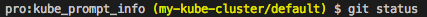

# kube_prompt_info

Like [git_prompt_info](https://github.com/robbyrussell/oh-my-zsh/blob/master/lib/git.zsh) of [oh-my-zsh](https://github.com/robbyrussell/oh-my-zsh), outputs current context and namespace info of kubectl in prompt format.

## Installation

```
$ go get github.com/yuya-takeyama/kube_prompt_info
```

## Setup

### zsh

Embed `$(kube_prompt_info)` in the `$PROMPT` variable.

e.g. Append these lines in `~/.zshrc`:

```zsh
PROMPT='%m:%c $(kube_prompt_info) %(!.#.$) '

export KUBE_PROMPT_INFO_PREFIX="%{$fg[yellow]%}("
export KUBE_PROMPT_INFO_SUFFIX=")%{$reset_color%}"
```

Result:


## Environment Variables

* `KUBE_PROMPT_INFO_PREFIX`
  * Prefix of the output
* `KUBE_PROMPT_INFO_SUFFIX`
  * Suffix of the output
* `KUBE_PROMPT_INFO_DEBUG`
  * If a value is set, it outputs error message when something is wrong
